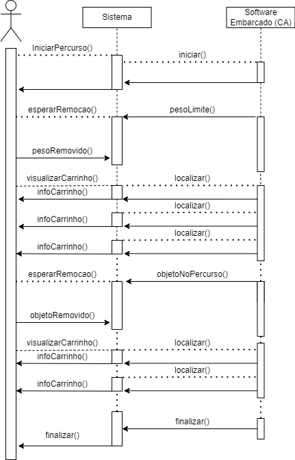

#   Arquitetura do projeto
 
### Finalidade 

O documento estabelecerá uma visão da arquitetura de software adotada no sistema Carnalize. Com isso, ele tem como finalidade monitorar as atividades do carro autônomo desenvolvido pela equipe do projeto. Disponibilizando informações para garantir um melhor controle e acompanhamento do veículo.

 
### Escopo

Essa documentação foi elaborada sobre a visão de arquitetura de software que será utilizada para a implementação do projeto Carnalize. Serão abordados os padrões de arquitetura, o framework que será usado no desenvolvimento do projeto e as ferramentas utilizadas para auxílio da equipe. O objetivo é fornecer um monitoramento sobre o carrinho, notificando o usuário de suas atividades.

## Visão Geral

Aqui serão detalhados as características primordiais da arquitetura adotada pela equipe desenvolvedora. Estarão presentes a representação arquitetural, as restrições de arquitetura, visão lógica, de implementação e de dados.

 
### Representação da Arquitetura 
 
Para o desenvolvimento da aplicação Carnalize, foi decidido a utilização de apenas um serviço. Devido as características propostas ao aplicativo e após análise da equipe de desenvolvimento, conclui-se que apenas 1 serviço seria suficiente para suprir todos os requisitos levantados.

 No sistema Carnalize foi decidido a criação do serviço:
 
- **Front-end**: Responsável pela visualização de todo o sistema e interação com usuário.

Para o desenvolvimento do serviço será utilizado a seguinte tecnologia:

#### React JS 

No front-end é onde ocorre a interação e apresentação das informações ao usuário da aplicação. React.js é um framework Javascript utilizado para desenvolver interfaces de usuário em aplicações web, com alto nível de valor agregado e qualidade final no produto, com fácil aprendizagem e facilidade de aplicação por parte da equipe. Ele é popular por ser fácil de usar, altamente flexível e escalável, e é usado por muitas empresas de tecnologia, incluindo o Facebook, Instagram e Airbnb.

### Metas e restrições da arquitetura
 
Metas:

+ Funcionar nos principais browsers utilizados atualmente: Mozilla Firefox, Google Chrome e Microsoft Edge.
 
+ O código deve ser modularizado, facilitando a manutenção e com baixo acoplamento.
 
Restrições:

+ Conexão com a Internet.

### Ambiente e Ferramentas de Desenvolvimento
 
| Requisito | Ferramenta | Versão |Descrição |
|----|-----|---|---|
|Linguagem|Javascript|ES6|Linguagem de programação|
|Framework|React.js|18.2.0|Framework React|
|Virtualização|Docker|20.10.17| Plataforma aberta que facilita a criação e administração de ambientes isolados|
|Virtualização|Docker-compose|2.17.12|Gerenciamento de contêiner|

## Visão de Casos de Uso

Os casos de uso do sistema Carnalize serão apresentados abaixo:

## Visão Lógica
 
 
Esta sessão apresenta os pacotes de design significativos do ponto de vista da arquitetura para a aplicação Carnalize.

### Pacotes Carnalize
 

Nesse diagrama, os pacotes estão divididos de acordo com as funcionalidades do aplicativo.

+ 
Estado: é responsável por monitorar se o carrinho está em andamento ou parado. /p>

+ 
Visualização: é responsável pelas informações que o usuário poderá visualizar, como a velocidade atual do carrinho.

+ 
Notificação: é responsável por alertar o usuário em caso de obstáculo identificado, portanto dependerá do pacote de “Visualização”.

+ 
Monitoramento: este pacote é responsável por verificar se a carga máxima do carrinho foi atingida, para que o usuário saiba que já pode iniciar o movimento com a carga máxima ou não, caso deseje. 

+ 
Controle: é responsável por enviar os comandos para iniciar o movimento do carrinho, e dependerá do pacote "Monitoramento". 

## Visão de Processos

A visão de Processo evidencia as ações processadas pelo sistema em tempo de execução, além da alocação de objetos e classes para tarefas. É uma visão que permite a visualização das partes dinâmicas do sistema, onde é evidenciado os processos, as threads e as interações entre elas.

### Diagrama de sequência

O diagrama de sequência é uma solução dinâmica de modelagem em UML bastante utilizada para demonstrar um conjunto de interações entre os componentes de um sistema. Em nossa implementação utilizamos este diagrama de sequência para mostrar alguns processos de nosso sistema.

### Diagrama de atividades

Se tratam de diagramas de comportamento UML que demonstram os fluxos de controle ou os fluxos de objetos focados na sequência e nas condições de cada um de forma a elucidar o fluxo entre as ações de uma determinada atividade.

Este diagrama ajuda a complementar a representação da visão de processos da arquitetura, e tomando uma abordagem com ênfase no fluxo de controle de atividades.

### Usabilidade

Característica de um sistema que pode ser utilizado pelos mais diferentes usuários para atingir diversos os objetivos especificados anteriormente, com eficácia, eficiência e satisfação.

A interface do Carnalize é projetada para ser fácil de operar e controlar, com navegabilidade intuitiva, para garantir que o sistema possa ser utilizado por usuários com a mais ampla gama de características e capacidades.

### Portabilidade

Grau de eficácia e eficiência com o qual um sistema pode ser transferido de um hardware, software ou outro ambiente operacional, ou de utilização para outro.

Esta é uma característica que não é tão significativa, visto que a utilização da nossa aplicação será direcionada a plataforma mobile.

## Referências

+ Alura. <b>React: o que é, como funciona e um Guia dessa popular ferramenta JS</b>. Disponível em: [ReactJS](https://www.alura.com.br/artigos/react-js). Acesso em 21 de abril de 2023.

+ Docker docs. <b>Docker overview</b>. Disponível em: [Docker](https://docs.docker.com/get-started/overview/). Acesso em 21 de abril de 2023.

+ Repositório Institucional Associação Educativa Evangélica. <b>Documento de Arquitetura de Software</b> Disponível em: [Documento de arquitetura de Software](http://repositorio.aee.edu.br/bitstream/aee/1106/3/TCC2_2018_2_GabrielLeiteDias_MatheusLimadeAlbuquerque_Apendice2.pdf)
 
## Versionamento
 
| Data | Versão | Descrição | Autor(es) |
|------|------|------|------|
|21/04/2023|1.0|Criação do documento de arquitetura de software do projeto | [João Pedro](https://github.com/Joao-Pedro-Moura)|
|22/04/2023|1.1|Adição do conteúdo dos tópicos do documento | [João Pedro](https://github.com/Joao-Pedro-Moura), [Erick Melo](https://github.com/ErickMVdO), [Paulo Batista](https://github.com/higton), [Marcos Felipe](https://github.com/Marofelipe) |
